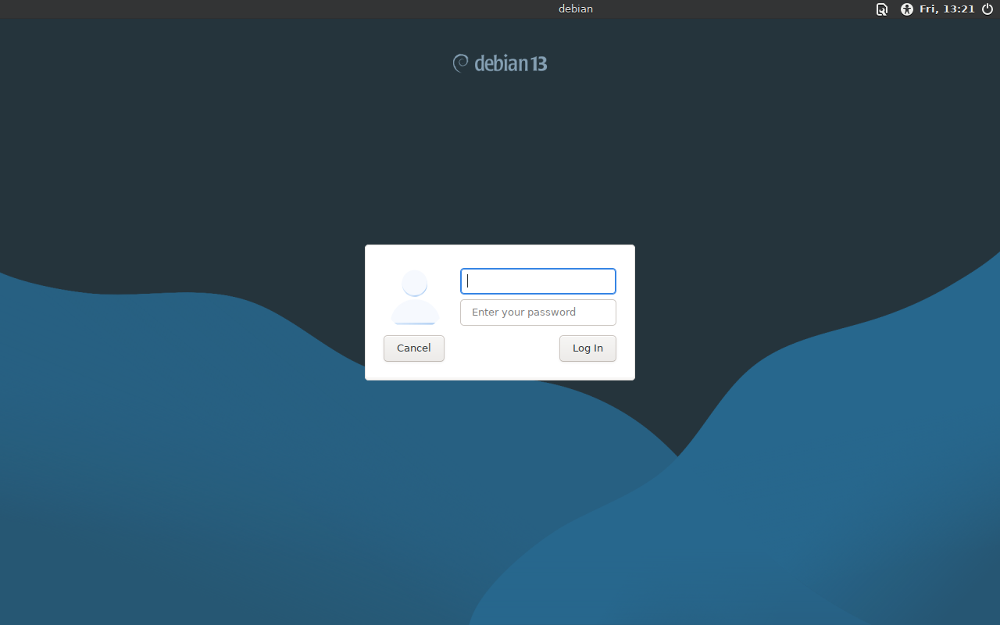
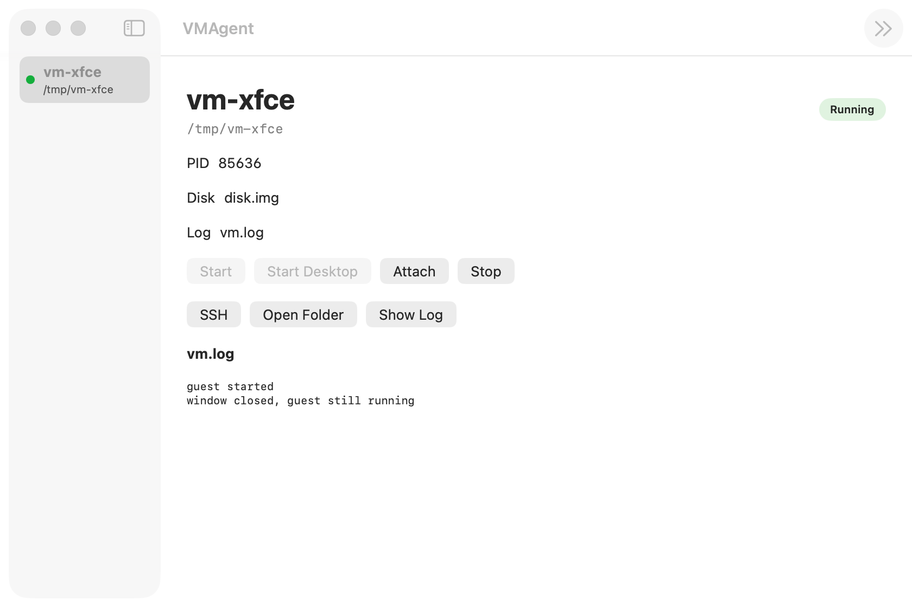

# vmagent

Boot a Debian cloud image on macOS. Apple silicon, macOS 13+.

Rust does the setup. A small Swift program (`vmcore`) calls Virtualization.framework, because that framework has no C API and Rust cannot link it.

## 1. Build

```bash
scripts/build.sh
```

## 2. Fetch the image

Once:

```bash
scripts/fetch-debian.sh
```

## 3. Start a VM

```bash
bin/vmagent --image images/debian.raw \
  --user-data cloud-init/user-data \
  --meta-data cloud-init/meta-data \
  --dir /tmp/vm
```

Headless. Login is `debian` / `debian`. The command returns immediately. The guest keeps running after the terminal exits. Closing the window, or Ctrl+C, does not stop it.

`--dir` holds the disk copy, `vm.log` (host), and `console.log` (guest). Without it, files go under `/tmp/vmagent-<time>`.

`vmagent` copies the image, splits `vmlinuz` and `initrd.img` out of `/boot`, and `vmcore` starts them with `VZLinuxBootLoader`. `root=` comes from `grub.cfg`. `--user-data` attaches a `cidata` disk and points cloud-init at it. Cloud-init runs once per `instance-id`.

Wait about a minute on a fresh disk. `guest started` in `vm.log` only means the host process is up.

## 4. Desktop

Same image. Pass `cloud-init/user-data-gui` and more RAM. The working disk grows to 8G (`--disk-gb`) so `task-xfce-desktop` fits. Use a new `--dir`. Cloud-init will not retry packages on a disk that already ran.

```bash
bin/vmagent --image images/debian.raw \
  --user-data cloud-init/user-data-gui \
  --meta-data cloud-init/meta-data \
  --dir /tmp/vm-gui \
  --mem-mb 4096
```

First boot is slow. `console.log` can sit on `Reached target Cloud-init target.` for many minutes while apt runs. Then the window shows the XFCE login. Log in as `debian` / `debian`.



Close the window and open it again with `bin/vmagent attach --dir /tmp/vm-gui`.

## 5. SSH and copy files

Each `--dir` gets a stable MAC. `ssh` and `scp` look that MAC up in `arp -an` and replace `vm` with the guest address. `no address` means the guest is not up yet. Password is `debian`.

```bash
bin/vmagent ssh --dir /tmp/vm debian@vm
echo hello > /tmp/hello
bin/vmagent scp --dir /tmp/vm /tmp/hello debian@vm:/tmp/hello
bin/vmagent ssh --dir /tmp/vm debian@vm cat /tmp/hello
```

## 6. List, reattach, stop

```bash
bin/vmagent list
bin/vmagent attach --dir /tmp/vm
bin/vmagent stop --dir /tmp/vm
```

`list` reads running `vmcore` processes. `attach` opens the window. `stop` kills the VM. `list --json` is what the manager GUI uses.

## 7. Manager GUI

Rust still does setup. SwiftUI (`gui/`) lists VMs and calls `vmagent`. The guest window is still `vmcore`.

```bash
scripts/build-gui.sh
open bin/VMAgent.app
```



New VMs go in `~/VMs/<name>`. Fetch the Debian image from the VM menu if `images/debian.raw` is missing. Start, attach, stop, and SSH use the same commands as the CLI.

## 8. Run commands and edit files

Same ssh session as `debian`. `--sudo` runs as root.

```bash
bin/vmagent run --dir /tmp/vm uname -a
bin/vmagent read --dir /tmp/vm /etc/os-release --offset 1 --limit 20
bin/vmagent write --dir /tmp/vm /tmp/hello --file ./hello
bin/vmagent edit --dir /tmp/vm /tmp/hello --old 'hello' --new 'hello world'
```
